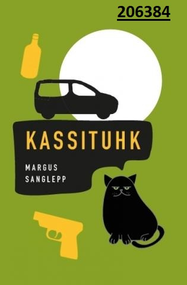

<!DOCTYPE html>
   <html lang="et">
       <head>
           <meta charset="utf-8">
       </head>
<h1><b>Raamatupood</b></h1>
<h3><b>Hetkel poes</b></h3>
       <body>
           <table border="1"
 width="100%"
 height="100px">
 <tr>
 <td align="center"><b>Raamat</b></td>
 <td align="center"><b>Autor</b></td>
 <td align="center"><b>Kirjastus</b></td>
 <td align="center"><b>Aasta</b></td>
 </tr>
<tr>
 <td align="center">"Kassituhk"</td>
 <td align="center">Margus Sanglepp</td>
 <td align="center">Tänapäev</td>
 <td align="center">2020</td>
 </tr>
</table>

<table border="1"
 width="100%"
 height="500px">

„Kassituhk“ on seikluslik lugu kirjandusõpetajast Antist, kes avastab, et kõik kohustused, mis olid seni harjumuspärast elurutiini kujundanud, on äkitselt ära langenud. Enne uusi väljakutseid seisab siiski ees lõplik hüvastijätt kalli sõbraga. Loodetav lohutust pakkuv ringsõit mööda Eestit kujuneb aga hoopiski suuremat sorti kaoseks, kuhu on segatud kummalisi tegelasi, kes satuvad inimese eluteele just siis, kui ta tunneb end elulainetesse uppuvat.

       </body>
<body>

</body>
<body>
<a href="https://www.taltech.ee">Tallinna Tehnikaülikool</a>
</body>
   </html>
